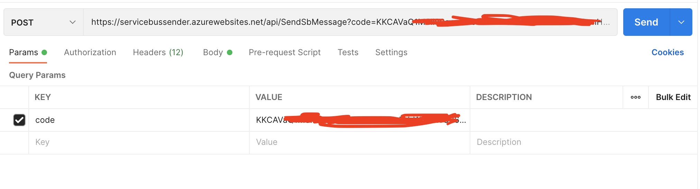
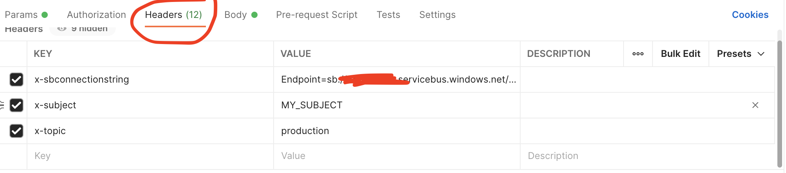
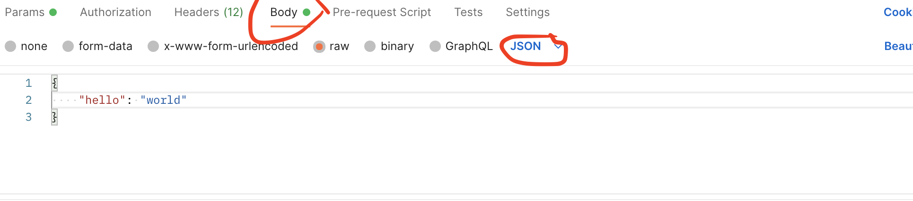

# Send a message to a service bus via Postman

Share requests with your teams.

0) Host the function in your Azure account

1) Use the code (as query param) to authenticate to your Azure function

2) Use the headers to specify the connection string, the subject and the topic

3) Use the body to specify the payload

